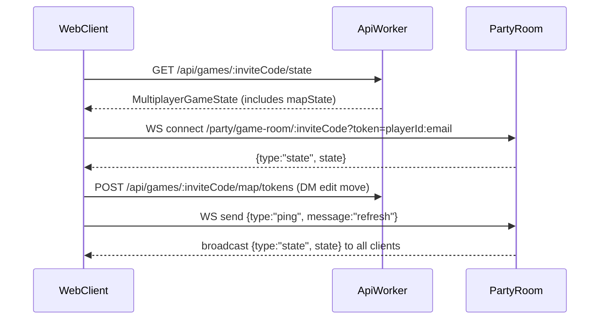

# Web Realtime Session View (MVP + DM Physical-Board Control)

## Goal

Turn the web route [`src/routes/multiplayer-game.tsx`](/Users/cmoyer/Projects/personal/ai-dnd-expo/src/routes/multiplayer-game.tsx) into a playable realtime tabletop view where the **DM can fully run the board** (pan/zoom, move tokens, manage turns), and also **edit initiative values**.

## Key capabilities to include

- **Realtime sync**: connect to PartyServer room and receive `{ type: 'state', state }` updates (see [`api/src/partykit/server.ts`](/Users/cmoyer/Projects/personal/ai-dnd-expo/api/src/partykit/server.ts)), with polling fallback.
- **Canvas map (pan/zoom)**: render grid + terrain + tokens.
- **DM control like a physical board**:
- Host-only **Board Edit Mode**: drag/move any token without movement-budget side effects.
- Host-only **Pause Players**: interrupt/resume turn to show a blocking overlay for non-hosts.
- Host-only **Start Turn** for any entity (already supported by `POST /api/games/:inviteCode/turn/start`).
- **Initiative editor (host-only)**: numeric edit per entity initiative value, auto re-sort, optional “Start Turn” per row.

## Realtime + REST data flow

## Plan

### 1) Web state + websocket plumbing

- Add a web server-fn for **fetching game state**:
- `fetchGameState`: `GET /games/:inviteCode/state` using TanStack Start + `useAuthSession()` in [`src/utils/games.ts`](/Users/cmoyer/Projects/personal/ai-dnd-expo/src/utils/games.ts).
- `gameStateQueryOptions(inviteCode)` with key `['games', inviteCode, 'state']`.
- Harden [`src/hooks/use-websocket-browser.ts`](/Users/cmoyer/Projects/personal/ai-dnd-expo/src/hooks/use-websocket-browser.ts) to handle PartyServer message shapes:
- `{ type: 'state', state }` (already supported)
- `{ type: 'error', message }` (PartyServer uses this shape; don’t assume `message.data.error`)
- `{ type: 'presence', ... }` (ignore or store for UI)
- Provide `sendRefresh()` helper in the multiplayer route that does:
- `ws.send({ type: 'ping', message: 'refresh' })`

### 2) API support for DM initiative editing

There is currently **no endpoint** to edit initiative values; add one.

- Add `GameStateService.updateInitiativeEntry(...)` in [`api/src/services/game-state.ts`](/Users/cmoyer/Projects/personal/ai-dnd-expo/api/src/services/game-state.ts):
- Input: `{ entityId: string; initiative: number }`
- Requirements: `state.status === 'active'`, `initiativeOrder` exists
- Update the matching entry’s `initiative` (and optionally clear `roll`), then **re-sort** by:
- `initiative` desc
- `dexMod` desc
- stable by previous index
- Keep `activeTurn.entityId` unchanged if possible (don’t surprise-swap turns just because initiative changes).
- Save + return updated state.
- Add a host-only route in [`api/src/routes/games/turns.ts`](/Users/cmoyer/Projects/personal/ai-dnd-expo/api/src/routes/games/turns.ts):
- `POST /api/games/:inviteCode/initiative/update`
- Calls the service method above.

### 3) Web server-fns for MVP actions (including initiative)

Add TanStack Start server-fns (wrapper shape `fn({ data: payload })`):

- **Turns** (existing API):
- `startTurn` → `POST /games/:inviteCode/turn/start`
- `interruptTurn` / `resumeTurn` → `POST /games/:inviteCode/turn/interrupt|resume`
- `endTurn` / `nextTurn` → `POST /games/:inviteCode/turn/end|next`
- **Map**:
- `saveMapToken` → `POST /games/:inviteCode/map/tokens` (DM edit mode drag/placement)
- `moveToken` → `POST /games/:inviteCode/map/move` (player gameplay movement + costs)
- **Initiative**:
- `updateInitiative` → `POST /games/:inviteCode/initiative/update`

After each successful mutation:

- update local cached state from response when available
- call `sendRefresh()` so PartyServer broadcasts the newest state to everyone.

### 4) Implement the web `/multiplayer-game` session screen

Replace the stub in [`src/routes/multiplayer-game.tsx`](/Users/cmoyer/Projects/personal/ai-dnd-expo/src/routes/multiplayer-game.tsx):

- Read `inviteCode` from search params.
- Load initial `MultiplayerGameState` via query; connect websocket via `useWebSocketBrowser`.
- Compute:
- `isHost = user.id === gameState.hostId`
- `playerCharacterId = gameState.players.find(p => p.playerId === user.id)?.characterId`
- If non-host and not a member of `players`, redirect to [`src/routes/game/$invite-code.tsx`](/Users/cmoyer/Projects/personal/ai-dnd-expo/src/routes/game/$invite-code.tsx).
- UI layout:
- **Left panel (DM controls)**: connection, pause/resume, start turn, end/next turn, board edit toggle.
- **Center**: `MapCanvas`
- **Right panel (Initiative)**: list `initiativeOrder` with numeric inputs + “Start Turn” per row.
- Non-host overlay:
- If `pausedTurn` exists and `!isHost`, show blocking overlay “DM is making a move”.

### 5) Canvas map renderer with “physical board” controls

Add [`src/components/map/MapCanvas.tsx`](/Users/cmoyer/Projects/personal/ai-dnd-expo/src/components/map/MapCanvas.tsx):

- Render:
- tiles from `mapState.terrain` (use quick colors; show blocked/difficult visually)
- tokens from `mapState.tokens`
- Interactions:
- pan/zoom
- token select
- host **Board Edit Mode**: drag token → call `saveMapToken` (no movement budget side effects)
- player gameplay: click-to-move selected token → call `moveToken`
- Token identity rule (important for turns):
- player token’s active entity is `token.entityId` (character id)
- npc token’s active entity is `token.id` (entityId already equals token.id)

### 6) Testing plan (no dev server commands)

- Host: start game → land on `/multiplayer-game` → pause players → drag tokens in edit mode → resume → set turn from initiative list.
- Player: join → see pause overlay when paused → when resumed and it’s their turn, click-to-move works.
- Validate that after each DM action, both clients converge via websocket refresh.

## Files expected to change/add

- Update:
- [`src/routes/multiplayer-game.tsx`](/Users/cmoyer/Projects/personal/ai-dnd-expo/src/routes/multiplayer-game.tsx)
- [`src/hooks/use-websocket-browser.ts`](/Users/cmoyer/Projects/personal/ai-dnd-expo/src/hooks/use-websocket-browser.ts)
- [`src/utils/games.ts`](/Users/cmoyer/Projects/personal/ai-dnd-expo/src/utils/games.ts) (add game-state fetch/query + server-fns or factor into new utils modules)