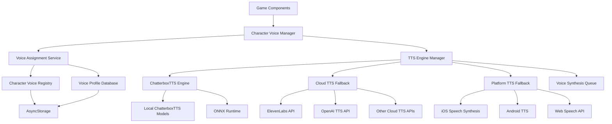

# Design Document

## Overview

This design implements a character-specific text-to-speech system that provides unique, consistent voices for each character in the D&D game. The system prioritizes ChatterboxTTS for local, high-quality voice synthesis with intelligent fallback to cloud-based APIs when local processing is unavailable.

The solution addresses the core challenge of maintaining voice consistency across game sessions while providing sufficient voice variety to distinguish between multiple characters (player characters, NPCs, AI companions, and the Dungeon Master). ChatterboxTTS provides the ideal balance of quality, variety, and local processing capabilities for mobile devices.

## Architecture

### High-Level Architecture



### Integration with Existing Systems

The Character Voice TTS system integrates with:

1. **AI Service Manager**: Extends the existing service architecture pattern
2. **Game State Management**: Leverages character tracking from `useGameState`
3. **Current TTS Hook**: Enhances `useTextToSpeech` with character-specific functionality
4. **On-Device First**: Prefer platform capabilities; avoid bespoke local runtimes unless necessary

## Components and Interfaces

### 1. Character Voice Manager

**Purpose**: Central orchestrator for character voice assignments and speech synthesis.

```typescript
interface CharacterVoiceManager {
  // Voice assignment
  assignVoiceToCharacter(characterId: string, characterType: CharacterType): Promise<VoiceProfile>;
  getCharacterVoice(characterId: string): VoiceProfile | null;
  
  // Speech synthesis
  speakAsCharacter(characterId: string, text: string, options?: SpeechOptions): Promise<void>;
  
  // Voice management
  getAvailableVoices(): VoiceProfile[];
  reassignCharacterVoice(characterId: string, voiceId: string): Promise<void>;
  
  // Persistence
  saveVoiceAssignments(): Promise<void>;
  loadVoiceAssignments(): Promise<void>;
}
```

### 2. Voice Assignment Service

**Purpose**: Intelligent assignment of unique voices to characters based on character traits and available voice profiles.

```typescript
interface VoiceAssignmentService {
  assignOptimalVoice(character: Character): VoiceProfile;
  findBestVoiceMatch(characterTraits: CharacterTraits): VoiceProfile[];
  ensureVoiceUniqueness(assignedVoices: Map<string, string>): boolean;
  handleVoiceConflicts(conflictingCharacters: string[]): VoiceAssignment[];
}

interface CharacterTraits {
  race: string;
  class: string;
  gender?: 'male' | 'female' | 'neutral';
  personality?: string;
  age?: 'young' | 'adult' | 'elderly';
  characterType: 'player' | 'npc' | 'companion' | 'dm';
}
```

### 3. TTS Engine Manager

**Purpose**: Manages ChatterboxTTS as primary engine with cloud and platform fallbacks.

```typescript
interface TTSEngineManager {
  // Engine management
  initializeEngines(): Promise<void>;
  getAvailableEngines(): TTSEngine[];
  selectBestEngine(requirements: TTSRequirements): TTSEngine;
  
  // Speech synthesis
  synthesizeSpeech(text: string, voiceProfile: VoiceProfile): Promise<AudioBuffer>;
  
  // Quality and performance
  optimizeForDevice(): Promise<void>;
  enablePowerSavingMode(enabled: boolean): void;
}

interface TTSEngine {
  id: string;
  name: string;
  type: 'chatterbox' | 'cloud' | 'platform';
  quality: 'low' | 'medium' | 'high';
  supportedLanguages: string[];
  supportedVoices: VoiceProfile[];
  isAvailable(): Promise<boolean>;
  synthesize(text: string, voice: VoiceProfile): Promise<AudioBuffer>;
}

interface ChatterboxTTSEngine extends TTSEngine {
  type: 'chatterbox';
  modelPath: string;
  isModelLoaded: boolean;
  loadModel(): Promise<void>;
  unloadModel(): Promise<void>;
  getResourceUsage(): ResourceUsage;
}

interface CloudTTSEngine extends TTSEngine {
  type: 'cloud';
  apiKey: string;
  endpoint: string;
  rateLimits: RateLimitConfig;
  checkQuota(): Promise<QuotaStatus>;
}
```

### 4. Voice Profile System

**Purpose**: Defines and manages voice characteristics and metadata.

```typescript
interface VoiceProfile {
  id: string;
  name: string;
  displayName: string;
  
  // Technical properties
  engine: 'platform' | 'onnx';
  engineVoiceId: string;
  language: string;
  
  // Voice characteristics
  gender: 'male' | 'female' | 'neutral';
  age: 'young' | 'adult' | 'elderly';
  pitch: number; // 0.5 - 2.0
  rate: number;  // 0.1 - 1.0
  quality: 'low' | 'medium' | 'high';
  
  // Character suitability
  suitableFor: CharacterType[];
  personality: string[];
  
  // Usage tracking
  isAssigned: boolean;
  assignedTo?: string;
  lastUsed?: number;
}

type CharacterType = 'player' | 'npc' | 'companion' | 'dm' | 'narrator';
```

### 5. Character Voice Registry

**Purpose**: Persistent storage and retrieval of character-voice assignments.

```typescript
interface CharacterVoiceRegistry {
  // Assignment management
  setCharacterVoice(characterId: string, voiceId: string): Promise<void>;
  getCharacterVoice(characterId: string): Promise<string | null>;
  removeCharacterVoice(characterId: string): Promise<void>;
  
  // Bulk operations
  getAllAssignments(): Promise<Map<string, string>>;
  setAllAssignments(assignments: Map<string, string>): Promise<void>;
  clearAllAssignments(): Promise<void>;
  
  // Migration and cleanup
  migrateOldAssignments(): Promise<void>;
  cleanupOrphanedAssignments(validCharacterIds: string[]): Promise<void>;
}
```

## Data Models

### Voice Assignment Storage Schema

```typescript
interface VoiceAssignmentData {
  version: string;
  lastUpdated: number;
  assignments: {
    [characterId: string]: {
      voiceId: string;
      assignedAt: number;
      characterType: CharacterType;
      characterName: string;
      isLocked: boolean; // Prevents automatic reassignment
    };
  };
  voiceUsage: {
    [voiceId: string]: {
      assignedCount: number;
      lastUsed: number;
      totalUsageTime: number;
    };
  };
}
```

### ChatterboxTTS Configuration

```typescript
interface ChatterboxTTSConfig {
  modelPath: string;
  modelName: string;
  voiceModelPaths: { [voiceId: string]: string };
  sampleRate: number;
  supportedLanguages: string[];
  voiceProfiles: VoiceProfile[];
  resourceRequirements: {
    minMemoryMB: number;
    estimatedLoadTimeMs: number;
    cpuIntensive: boolean;
  };
}

interface CloudTTSConfig {
  provider: 'elevenlabs' | 'openai' | 'azure';
  apiKey: string;
  endpoint: string;
  voiceMapping: { [localVoiceId: string]: string }; // Map local voices to cloud voices
  rateLimits: {
    requestsPerMinute: number;
    charactersPerMonth: number;
  };
  fallbackEnabled: boolean;
}
```

## Error Handling

### Graceful Degradation Strategy

1. **ChatterboxTTS Failure**: Fall back to cloud TTS API
2. **Cloud TTS Failure**: Fall back to platform TTS
3. **Platform TTS Failure**: Fall back to silent mode with text display
4. **Voice Assignment Conflict**: Use intelligent reassignment algorithm
5. **Storage Failure**: Use in-memory assignments for session
6. **Model Loading Failure**: Provide clear user feedback and cloud alternatives

### Error Recovery Mechanisms

```typescript
interface ErrorRecoveryStrategy {
  // TTS engine failures
  handleEngineFailure(engine: TTSEngine, error: Error): Promise<TTSEngine | null>;
  
  // Voice assignment failures
  handleAssignmentFailure(characterId: string, error: Error): Promise<VoiceProfile>;
  
  // Storage failures
  handleStorageFailure(operation: string, error: Error): Promise<boolean>;
  
  // Model loading failures
  handleModelLoadFailure(modelPath: string, error: Error): Promise<void>;
}
```

## Testing Strategy

### Unit Testing

1. **Voice Assignment Logic**: Test character trait matching and uniqueness constraints
2. **TTS Engine Management**: Test engine selection and fallback mechanisms
3. **Storage Operations**: Test persistence and retrieval of voice assignments
4. **Voice Profile Management**: Test profile creation and modification

### Integration Testing

1. **End-to-End Voice Assignment**: Test complete flow from character creation to speech
2. **Cross-Session Persistence**: Test voice consistency across app restarts
3. **Multi-Character Scenarios**: Test voice uniqueness with multiple active characters
4. **Performance Testing**: Test memory usage and synthesis speed

### Platform Testing

1. **iOS Testing**: Test with various iOS voices and system configurations
2. **Android Testing**: Test with different Android TTS engines
3. **Web Testing**: Test Web Speech API compatibility
4. **Offline Testing**: Verify complete offline functionality

### ONNX Model Testing

1. **Model Loading**: Test ONNX model initialization and resource usage
2. **Voice Quality**: Compare ONNX vs platform TTS quality
3. **Performance Impact**: Measure CPU and memory usage
4. **Fallback Scenarios**: Test graceful degradation when ONNX fails

## Implementation Phases

### Phase 1: Core Infrastructure
- Implement Character Voice Manager
- Create Voice Profile system with ChatterboxTTS voice definitions
- Set up Character Voice Registry with AsyncStorage
- Extend existing TTS hook for character-specific functionality

### Phase 2: ChatterboxTTS Integration
- Research and integrate ChatterboxTTS ONNX models
- Implement ChatterboxTTS engine with ONNX runtime
- Add model loading and resource management
- Integrate with platform capabilities when available
- Implement voice assignment algorithms with ChatterboxTTS voices

### Phase 3: Cloud TTS Fallback
- Implement cloud TTS providers (ElevenLabs, OpenAI)
- Add voice mapping between local and cloud voices
- Implement intelligent fallback logic
- Add cloud audio caching for offline replay
- Add rate limiting and quota management

### Phase 4: Platform TTS Final Fallback
- Enhance platform TTS engine support as final fallback
- Add voice uniqueness constraints across all engines
- Create voice preview functionality
- Implement comprehensive error handling

### Phase 5: Advanced Features & Polish
- Add voice customization UI
- Implement voice personality matching
- Add voice usage analytics and optimization
- Optimize performance and memory usage
- Add accessibility features and user controls

## Technical Considerations

### ChatterboxTTS Integration

**ChatterboxTTS Advantages**:
1. **Local Processing**: Complete offline functionality
2. **High Quality**: Neural TTS with natural-sounding voices
3. **Multiple Voices**: Variety of character-appropriate voices
4. **Mobile Optimized**: Designed for on-device inference
5. **Platform Compatible**: Integrates cleanly with platform/NLU capabilities

**Model Requirements**:
- Mobile-optimized (< 100MB total for all voice models)
- Fast inference (< 1000ms for typical D&D responses)
- Multiple distinct voice options (minimum 8-10 voices)
- Support for English language with good pronunciation
- Compatible with existing ONNX runtime

### Cloud TTS Fallback Strategy

**Recommended Cloud Providers**:
1. **ElevenLabs**: High-quality voices with character variety
2. **OpenAI TTS**: Good quality with reasonable pricing
3. **Azure Cognitive Services**: Reliable with global availability

**Fallback Logic**:
- Maintain voice consistency by mapping local ChatterboxTTS voices to similar cloud voices
- Cache cloud-generated audio for offline replay
- Implement intelligent retry and rate limiting
- Provide user control over cloud usage (privacy/cost concerns)

### Performance Optimization

1. **Voice Model Caching**: Keep frequently used ChatterboxTTS models in memory
2. **Synthesis Queue**: Batch and prioritize speech requests
3. **Background Loading**: Pre-load ChatterboxTTS models during app initialization
4. **Resource Monitoring**: Adapt quality based on device capabilities
5. **Cloud Caching**: Store cloud TTS results locally for repeated phrases

### Platform-Specific Considerations

**iOS**:
- Leverage AVSpeechSynthesizer for high-quality platform voices
- Use Core ML for ONNX model optimization
- Handle app backgrounding and audio session management

**Android**:
- Support multiple TTS engines (Google, Samsung, etc.)
- Handle TTS engine installation and updates
- Optimize for various Android versions and devices

**Web**:
- Use Web Speech API where available
- Provide WebAssembly fallback for ONNX models
- Handle browser compatibility differences

### Integration

The Character Voice TTS system should integrate with platform capabilities or approved APIs:

1. **Shared ONNX Runtime**: Utilize existing ONNX runtime setup
2. **Model Management**: Follow existing patterns for local model loading
3. **Resource Sharing**: Coordinate resource usage with other AI services
4. **Configuration**: Extend existing AI service configuration system
