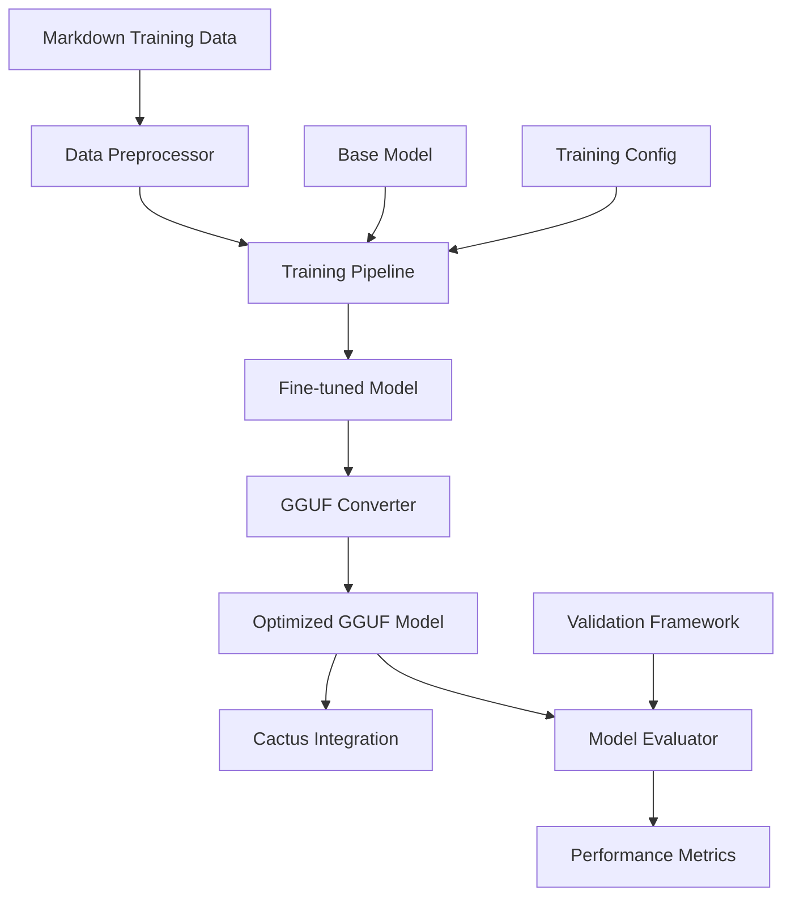

# Design Document

## Overview

The Custom GGUF Model Training system provides a comprehensive framework for fine-tuning language models specifically for D&D gameplay. The system leverages modern fine-tuning techniques like LoRA (Low-Rank Adaptation) and QLoRA for efficient training on local hardware, with automatic conversion to GGUF format for deployment with Cactus agents. The architecture supports markdown-based training data creation, automated preprocessing, and mobile-optimized model generation.

## Architecture

### High-Level Architecture



### Directory Structure

```
ai-training/
├── config/
│   ├── training_config.yaml
│   ├── model_configs/
│   └── optimization_profiles.yaml
├── data/
│   ├── scenarios/
│   │   ├── combat/
│   │   │   ├── tavern-brawl.md
│   │   │   ├── dragon-encounter.md
│   │   │   └── ambush-scenario.md
│   │   ├── roleplay/
│   │   │   ├── merchant-negotiation.md
│   │   │   ├── noble-court.md
│   │   │   └── tavern-gossip.md
│   │   ├── exploration/
│   │   │   ├── dungeon-discovery.md
│   │   │   ├── wilderness-travel.md
│   │   │   └── ancient-ruins.md
│   │   └── mixed/
│   │       ├── full-session-1.md
│   │       └── campaign-arc.md
│   ├── processed/
│   └── validation/
├── models/
│   ├── base/
│   ├── checkpoints/
│   ├── fine-tuned/
│   └── gguf/
├── scripts/
│   ├── setup.py
│   ├── preprocess.py
│   ├── train.py
│   ├── convert.py
│   └── validate.py
├── src/
│   ├── data_processing/
│   ├── training/
│   ├── conversion/
│   └── validation/
├── tools/
│   ├── markdown_parser.py
│   ├── tool_call_extractor.py
│   └── scenario_validator.py
└── requirements.txt
```

### Training Data Schema

Each markdown file in the scenarios folders follows this structured format:

```markdown
<SYSTEM>
# Role
You are the Dungeon Master of a D&D Campaign

# World
Faerun - a mystical realm filled with ancient magic, diverse races, and endless adventures. The world is recovering from recent conflicts between good and evil forces.

# Location
The party is gathered at the Prancing Pony tavern in the bustling trade city of Waterdeep. The tavern is crowded with merchants, adventurers, and locals sharing tales over ale.

# Party

## Chris
- Player Character
- Wizard
- Level 3
- Health: 18/18
- Exp: 750/2700
- Inventory: Spellbook, Staff of Power, 50 gold pieces, Health Potion x2
- Spells: Magic Missile, Shield, Fireball

## Sarah
- Player Character  
- Rogue
- Level 3
- Health: 22/22
- Exp: 800/2700
- Inventory: Thieves' Tools, Shortsword +1, Leather Armor, 75 gold pieces
- Skills: Stealth +7, Sleight of Hand +6, Perception +5

## Thorin
- NPC Companion
- Dwarf Fighter
- Level 2
- Health: 28/28
- Exp: 300/900
- Inventory: Warhammer, Chain Mail, Shield, 25 gold pieces
</SYSTEM>

<User>I want to look around the tavern to see if there's anything suspicious</User>

<DM>That's a great idea! Let me have you roll for perception to see what you notice.

[roll: perception]</DM>

<TOOLCALL>perception: 12 + 5(skill) = *17*</TOOLCALL>

<DM>*SUCCESS* With your keen eyes, you notice several interesting details. In the far corner, a hooded figure sits alone, occasionally glancing toward your party. Near the bar, two merchants are having a heated whispered conversation about "missing shipments." The bartender seems nervous, wiping the same mug repeatedly while watching the room.

What would you like to investigate further?</DM>

<User>I'll try to get closer to the hooded figure without being noticed</User>

<DM>You crouch down and attempt to navigate the shadows.

[roll: stealth]</DM>

<TOOLCALL>stealth: 15 + 7(skill) = *22*</TOOLCALL>

<DM>*SUCCESS* You move like a shadow through the tavern, weaving between patrons with incredible grace. You manage to get close enough to overhear the hooded figure muttering about "the shipment arriving at midnight" and "meeting at the old warehouse by the docks."

The figure hasn't noticed you at all. What's your next move?</DM>

<User>I want to signal to Sarah and Thorin about what I discovered</User>

<DM>You attempt to signal to Sarah and Thorin without alerting the hooded figure.

[roll: sleight_of_hand]</DM>

<TOOLCALL>sleight_of_hand: 8 + 6(skill) = *14*</TOOLCALL>

<DM>*FAILED* You waive your hands as the hooded figure glances in your direction. It catches the sight of you and attacks.

**ROLL FOR INITIATIVE**

[roll: initiative]
[begin combat]
</DM>
```

This schema provides:
- **Structured System Context**: Clear role definition, world setting, location description, and complete party information
- **Natural Conversation Flow**: Realistic player-DM interactions with proper context
- **Tool Call Integration**: Embedded tool calls using `[roll: skill_name]` format
- **Tool Results**: Structured `<TOOLCALL>` responses with calculations and outcomes
- **Narrative Continuity**: Each response builds on previous actions and maintains story flow
- **Multiple Interaction Types**: Combat, roleplay, exploration, and skill challenges

## Components and Interfaces

### 1. Data Processing Pipeline

#### MarkdownParser
```python
class MarkdownParser:
    def parse_scenario(self, file_path: str) -> TrainingScenario
    def extract_system_context(self, content: str) -> SystemContext
    def extract_conversation(self, content: str) -> List[ConversationTurn]
    def validate_format(self, content: str) -> ValidationResult
```

#### TrainingDataProcessor
```python
class TrainingDataProcessor:
    def process_scenarios(self, scenario_dir: str) -> ProcessedDataset
    def create_training_pairs(self, scenarios: List[TrainingScenario]) -> List[TrainingPair]
    def augment_data(self, dataset: ProcessedDataset) -> ProcessedDataset
    def balance_dataset(self, dataset: ProcessedDataset) -> ProcessedDataset
```

### 2. Training Pipeline

#### ModelTrainer
```python
class ModelTrainer:
    def __init__(self, config: TrainingConfig)
    def load_base_model(self, model_path: str) -> BaseModel
    def setup_lora_config(self) -> LoRAConfig
    def train(self, dataset: ProcessedDataset) -> FineTunedModel
    def save_checkpoint(self, epoch: int, model: Model) -> None
    def evaluate(self, model: Model, validation_set: Dataset) -> Metrics
```

#### TrainingConfig
```python
@dataclass
class TrainingConfig:
    base_model: str
    learning_rate: float
    batch_size: int
    epochs: int
    lora_rank: int
    lora_alpha: int
    target_modules: List[str]
    gradient_accumulation_steps: int
    warmup_steps: int
    max_seq_length: int
    use_gpu: bool
    memory_limit_gb: float
```

### 3. GGUF Conversion System

#### GGUFConverter
```python
class GGUFConverter:
    def convert_to_gguf(self, model_path: str, output_path: str) -> str
    def quantize_model(self, model_path: str, quantization_type: str) -> str
    def optimize_for_mobile(self, model_path: str, size_limit_gb: float) -> str
    def validate_gguf(self, gguf_path: str) -> ValidationResult
```

### 4. Validation Framework

#### ModelValidator
```python
class ModelValidator:
    def validate_tool_calls(self, model: Model, test_scenarios: List[Scenario]) -> ToolCallMetrics
    def validate_conversation_quality(self, model: Model, test_set: Dataset) -> QualityMetrics
    def benchmark_performance(self, model: Model, baseline: Model) -> BenchmarkResults
    def test_cactus_compatibility(self, gguf_path: str) -> CompatibilityReport
```

## Data Models

### Training Data Structures

```python
@dataclass
class SystemContext:
    role: str
    world: str
    location: str
    party: List[Character]

@dataclass
class Character:
    name: str
    character_type: str  # "Player Character" or NPC type
    class_name: str
    level: int
    health: Tuple[int, int]  # current, max
    experience: Tuple[int, int]  # current, next_level
    inventory: List[str]
    stats: Dict[str, int]

@dataclass
class ConversationTurn:
    speaker: str  # "User", "DM", "TOOLCALL"
    content: str
    tool_calls: List[ToolCall] = None

@dataclass
class ToolCall:
    tool_name: str
    arguments: List[str]
    result: str = None

@dataclass
class TrainingScenario:
    system_context: SystemContext
    conversation: List[ConversationTurn]
    scenario_type: str
    metadata: Dict[str, Any]
```

### Model Configuration

```python
@dataclass
class ModelConfig:
    name: str
    base_model_path: str
    target_size_gb: float
    quantization_type: str
    optimization_profile: str
    supported_tools: List[str]

@dataclass
class OptimizationProfile:
    name: str
    target_platform: str  # "mobile", "desktop", "server"
    memory_limit_gb: float
    inference_speed_priority: float
    quality_priority: float
    quantization_settings: Dict[str, Any]
```

## Error Handling

### Training Error Recovery
- **Checkpoint Recovery**: Automatic resumption from last valid checkpoint on training interruption
- **Memory Management**: Dynamic batch size adjustment when GPU memory is insufficient
- **Data Validation**: Pre-training validation of all markdown scenarios with detailed error reporting
- **Model Compatibility**: Automatic fallback to CPU training if GPU acceleration fails

### Conversion Error Handling
- **Format Validation**: Comprehensive validation of GGUF format before deployment
- **Size Optimization**: Iterative quantization with quality checks to meet size constraints
- **Compatibility Testing**: Automated testing with Cactus agent before model approval

### Runtime Error Management
- **Tool Call Parsing**: Robust parsing with fallback to text-only responses for malformed tool calls
- **Context Management**: Automatic truncation and summarization for oversized contexts
- **Performance Monitoring**: Real-time monitoring with automatic model switching on performance degradation

## Testing Strategy

### Unit Testing
- **Data Processing**: Test markdown parsing, validation, and conversion to training format
- **Tool Call Extraction**: Validate extraction and formatting of tool calls from conversations
- **Model Configuration**: Test configuration loading, validation, and parameter setup
- **GGUF Conversion**: Test conversion pipeline with various model sizes and quantization levels

### Integration Testing
- **End-to-End Pipeline**: Test complete flow from markdown to deployed GGUF model
- **Cactus Integration**: Validate model loading and basic functionality in Cactus environment
- **Multi-Scenario Training**: Test training with diverse scenario types and validate generalization
- **Performance Benchmarking**: Compare trained models against baseline on standardized test sets

### Validation Testing
- **Tool Call Accuracy**: Measure accuracy of tool call generation and parameter extraction
- **Conversation Quality**: Evaluate response quality, coherence, and D&D appropriateness
- **Mobile Performance**: Test inference speed and memory usage on target mobile devices
- **Stress Testing**: Validate model behavior under edge cases and unusual inputs

### Acceptance Testing
- **Real Gameplay Testing**: Test trained models in actual D&D sessions with human players
- **Tool Integration**: Validate all supported tools work correctly with trained models
- **Performance Requirements**: Ensure models meet size and speed requirements for mobile deployment
- **Quality Assurance**: Verify trained models maintain or improve upon baseline model quality

## Implementation Phases

### Phase 1: Foundation
- Set up training environment and dependencies
- Implement markdown parsing and data processing pipeline
- Create basic training configuration system
- Establish project structure and tooling

### Phase 2: Training Pipeline
- Implement LoRA-based fine-tuning system
- Add support for multiple base models (Gemma, Qwen)
- Create checkpoint management and recovery system
- Implement basic validation and metrics collection

### Phase 3: GGUF Integration
- Develop GGUF conversion and quantization pipeline
- Implement mobile optimization and size constraints
- Create Cactus integration and compatibility testing
- Add performance monitoring and benchmarking

### Phase 4: Advanced Features
- Implement data augmentation and balancing techniques
- Add support for incremental training and model updates
- Create comprehensive validation and testing framework
- Develop automated deployment and rollback capabilities
