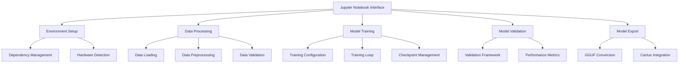

# Design Document: Custom GGUF Model Training

## Overview

This design document outlines the architecture and components for implementing a custom GGUF model training system for the AI D&D platform. The system will enable developers to fine-tune existing language models with D&D-specific data, creating optimized models that understand game mechanics, character interactions, and tool usage patterns. The entire training process will run within a Jupyter notebook environment on macOS, making it accessible to developers without requiring specialized infrastructure.

## Architecture

The custom GGUF model training system follows a modular architecture with the following key components:



### Components and Interfaces

#### 1. Jupyter Notebook Interface

The primary interface for the training system will be a Jupyter notebook that guides developers through the entire process from environment setup to model export.

**Key Features:**
- Interactive cells with explanatory markdown
- Code execution with real-time feedback
- Visualization of training progress and metrics
- Modular structure allowing execution of specific sections

**Implementation:**
- A main notebook (`train_gguf_model.ipynb`) with clearly defined sections
- Supporting Python modules imported by the notebook
- Configuration cells for customizing training parameters
- Visualization cells for monitoring training progress

#### 2. Environment Setup

This component handles the initialization of the training environment, including dependency management and hardware detection.

**Key Features:**
- Automated installation of required packages
- Detection of available hardware (CPU/GPU)
- Configuration of appropriate backends (Metal/CPU)
- Validation of environment readiness

**Implementation:**
```python
# Environment setup module
class EnvironmentManager:
    def __init__(self, requirements_file="requirements.txt"):
        self.requirements_file = requirements_file
        self.hardware_info = {}
        
    def detect_hardware(self):
        """Detect available hardware (CPU/GPU) and capabilities"""
        # Implementation for macOS Metal detection
        
    def install_dependencies(self):
        """Install required Python packages"""
        # Implementation using pip/conda
        
    def validate_environment(self):
        """Validate that all dependencies are correctly installed"""
        # Implementation with status report
```

#### 3. Data Processing

This component handles the loading, preprocessing, and validation of training data.

**Key Features:**
- Support for markdown-based training scenarios
- Parsing of system context, conversations, and tool calls
- Data cleaning and normalization
- Dataset splitting (train/validation)
- Data augmentation techniques

**Implementation:**
```python
# Data processing module
class DataProcessor:
    def __init__(self, data_dir="training_data"):
        self.data_dir = data_dir
        self.datasets = {}
        
    def load_markdown_scenarios(self, scenario_type=None):
        """Load markdown scenarios from directory"""
        # Implementation for parsing markdown files
        
    def parse_system_context(self, markdown_content):
        """Extract system context from markdown"""
        # Implementation for parsing headers
        
    def parse_conversations(self, markdown_content):
        """Extract conversations and tool calls"""
        # Implementation for parsing dialogue
        
    def prepare_training_data(self):
        """Convert parsed data to training format"""
        # Implementation for formatting training data
        
    def split_datasets(self, train_ratio=0.8):
        """Split data into training and validation sets"""
        # Implementation for dataset splitting
```

#### 4. Model Training

This component handles the configuration and execution of model training.

**Key Features:**
- Support for different base models (Gemma, Qwen)
- Hyperparameter configuration
- Training loop with progress monitoring
- Checkpoint management
- Early stopping based on validation metrics

**Implementation:**
```python
# Model training module
class ModelTrainer:
    def __init__(self, base_model, output_dir="trained_models"):
        self.base_model = base_model
        self.output_dir = output_dir
        self.training_args = {}
        
    def configure_training(self, learning_rate=1e-5, batch_size=4, epochs=3):
        """Configure training hyperparameters"""
        # Implementation for setting training arguments
        
    def prepare_model(self):
        """Load and prepare base model for fine-tuning"""
        # Implementation for model loading and preparation
        
    def train(self, train_dataset, val_dataset):
        """Execute training loop"""
        # Implementation for training process
        
    def save_checkpoint(self, step):
        """Save model checkpoint"""
        # Implementation for checkpoint saving
```

#### 5. Model Validation

This component handles the validation and testing of trained models.

**Key Features:**
- Evaluation on D&D-specific scenarios
- Tool call accuracy assessment
- Response quality evaluation
- Comparison with baseline models
- Generation of validation reports

**Implementation:**
```python
# Model validation module
class ModelValidator:
    def __init__(self, model_path):
        self.model_path = model_path
        self.metrics = {}
        
    def load_model(self):
        """Load trained model for validation"""
        # Implementation for model loading
        
    def evaluate_tool_calls(self, test_dataset):
        """Evaluate tool call accuracy"""
        # Implementation for tool call testing
        
    def evaluate_responses(self, test_dataset):
        """Evaluate response quality"""
        # Implementation for response quality testing
        
    def compare_with_baseline(self, baseline_model):
        """Compare with baseline model"""
        # Implementation for model comparison
        
    def generate_report(self):
        """Generate validation report"""
        # Implementation for report generation
```

#### 6. Model Export

This component handles the export of trained models to GGUF format and integration with Cactus.

**Key Features:**
- Conversion to GGUF format
- Model quantization options
- Size optimization for mobile deployment
- Generation of Cactus configuration templates
- Validation of exported models

**Implementation:**
```python
# Model export module
class ModelExporter:
    def __init__(self, model_path, output_dir="exported_models"):
        self.model_path = model_path
        self.output_dir = output_dir
        
    def convert_to_gguf(self, quantization_level="Q4_K_M"):
        """Convert model to GGUF format"""
        # Implementation for GGUF conversion
        
    def optimize_for_mobile(self, max_size_gb=2):
        """Optimize model size for mobile deployment"""
        # Implementation for size optimization
        
    def generate_cactus_config(self):
        """Generate Cactus configuration template"""
        # Implementation for config generation
        
    def validate_exported_model(self):
        """Validate exported model functionality"""
        # Implementation for export validation
```

## Data Models

### Training Data Structure

The training data will be organized in a hierarchical structure:

```
training_data/
├── combat/
│   ├── basic_combat.md
│   ├── complex_combat.md
│   └── ...
├── roleplay/
│   ├── tavern_interaction.md
│   ├── quest_negotiation.md
│   └── ...
├── exploration/
│   ├── dungeon_exploration.md
│   ├── wilderness_travel.md
│   └── ...
└── ...
```

### Markdown Scenario Format

Each markdown scenario will follow a structured format:

```markdown
# SYSTEM
Role: Dungeon Master
World: Forgotten Realms
Location: Tavern
Party:
- Thordak (Dragonborn Fighter, Level 5, HP: 45/45)
- Elara (Elf Wizard, Level 5, HP: 28/28)
- Grimm (Dwarf Cleric, Level 5, HP: 38/38)

# CONVERSATION
## User
I want to approach the bartender and ask about rumors in town.

## DM
The burly half-orc bartender looks up as you approach. "What'll it be?" he grunts, wiping a mug with a questionably clean rag.

When you ask about rumors, he leans in closer. "Well, there's been talk of strange lights in the old tower north of town. Some say it's ghosts, others say it's that crazy wizard Zandor up to no good again."

He eyes you up and down. "You lot look capable. Thinking of checking it out? Might want to test your perception first."

[roll: perception]

## TOOLCALL
perception: 15 + 10(skill) = *25*

## DM
With your keen awareness, you notice a hooded figure in the corner of the tavern who seems to be listening intently to your conversation. They quickly look away when they realize you've spotted them.

The bartender continues, "If you're heading to the tower, be careful. Last fellow who went there came back babbling nonsense about living statues."
```

### Training Configuration

The training configuration will be stored as a Python dictionary:

```python
training_config = {
    "base_model": "gemma-3-2b-it",
    "learning_rate": 1e-5,
    "batch_size": 4,
    "epochs": 3,
    "max_seq_length": 2048,
    "warmup_steps": 100,
    "weight_decay": 0.01,
    "quantization": "Q4_K_M",
    "output_dir": "trained_models/dnd_gemma_3b",
    "checkpoint_interval": 500
}
```

### Model Metadata

The model metadata will be stored as a JSON file:

```json
{
  "model_name": "dnd_gemma_3b_gguf",
  "base_model": "gemma-3-2b-it",
  "training_date": "2025-07-21",
  "training_steps": 1500,
  "final_loss": 0.0823,
  "validation_accuracy": 0.912,
  "tool_call_accuracy": 0.945,
  "quantization_level": "Q4_K_M",
  "file_size_mb": 1850,
  "compatible_platforms": ["macOS", "iOS", "Android"],
  "recommended_context_length": 2048,
  "supported_tools": ["roll", "health", "inventory", "spellcast", "check"]
}
```

## Error Handling

The system will implement comprehensive error handling to ensure a smooth training experience:

1. **Environment Setup Errors**
   - Dependency installation failures
   - Hardware compatibility issues
   - Python version mismatches

2. **Data Processing Errors**
   - Malformed markdown files
   - Missing required fields
   - Invalid tool call syntax

3. **Training Errors**
   - Out of memory errors
   - Model loading failures
   - Training divergence

4. **Export Errors**
   - Conversion failures
   - Size limit violations
   - Compatibility issues

Each error will be caught, logged with detailed information, and presented with actionable recovery suggestions.

## Testing Strategy

The testing strategy for the custom GGUF model training system includes:

### Unit Testing

- Test individual components (DataProcessor, ModelTrainer, etc.)
- Validate parsing logic for markdown scenarios
- Verify tool call extraction and formatting

### Integration Testing

- Test end-to-end training pipeline with small datasets
- Verify model loading, training, and export processes
- Validate integration between components

### Validation Testing

- Evaluate trained models on D&D-specific scenarios
- Test tool call accuracy and response quality
- Compare performance with baseline models

### Performance Testing

- Measure training speed and resource usage
- Evaluate inference performance on different hardware
- Test model size optimization techniques

## Implementation Plan

The implementation will follow these phases:

1. **Environment Setup**
   - Create Jupyter notebook structure
   - Implement dependency management
   - Add hardware detection and configuration

2. **Data Processing**
   - Implement markdown parsing
   - Create data preprocessing pipeline
   - Add validation and augmentation features

3. **Model Training**
   - Implement model loading and preparation
   - Create training loop with monitoring
   - Add checkpoint management

4. **Model Validation**
   - Implement validation framework
   - Create metrics calculation
   - Add comparison with baseline

5. **Model Export**
   - Implement GGUF conversion
   - Add quantization options
   - Create Cactus integration utilities

Each phase will be implemented as a separate section in the Jupyter notebook, allowing developers to execute the process step by step.

## Conclusion

This design provides a comprehensive framework for implementing a custom GGUF model training system for the AI D&D platform. By running entirely within a Jupyter notebook on macOS, the system will be accessible to developers without requiring specialized infrastructure. The modular architecture allows for flexibility and extensibility, while the structured data format ensures consistent training results.
