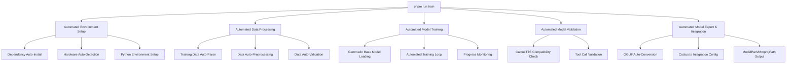
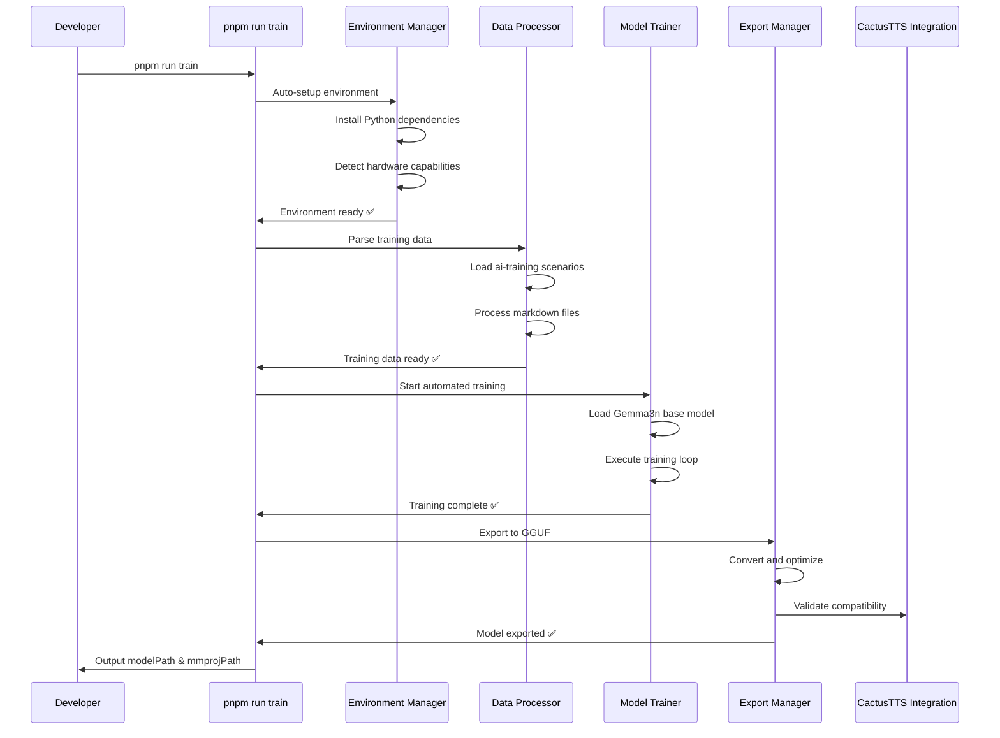

# Design Document: Custom GGUF Model Training (Deprecated)

## Overview

This document is deprecated. The platform now uses Apple on-device foundational models via `@react-native-ai/apple` with the `ai` SDK and no longer requires GGUF training or distribution.

The system will enable developers to fine-tune existing language models (specifically Gemma3n) with D&D-specific data, creating optimized models that understand game mechanics, character interactions, and tool usage patterns. The entire process will be fully automated, requiring no manual intervention, and will output the exact modelPath and mmprojPath configuration needed for seamless integration with the existing cactus.ts infrastructure.

## Architecture

The custom GGUF model training system follows a command-driven architecture centered around the `pnpm run train` command. The system is designed for complete automation with the following key components:



### Components and Interfaces

#### 1. Command-Line Interface (Primary)

The primary interface for the training system is the `pnpm run train` command that provides a fully automated, zero-configuration training experience.

**Key Features:**
- Single command execution with no user intervention required
- Automatic detection and installation of all dependencies
- Real-time progress updates and status reporting
- Automatic error handling with clear recovery instructions
- Direct output of integration configuration for cactus.ts

**Implementation:**
```json
// package.json scripts section
{
  "scripts": {
    "train": "node scripts/train-model.js",
    "train:dev": "node scripts/train-model.js --dev",
    "train:validate": "node scripts/validate-training.js"
  }
}
```

**Command Flow:**
1. Parse command-line arguments and configuration
2. Validate system requirements and auto-install dependencies
3. Load and process training data from ai-training directory
4. Execute automated training pipeline
5. Generate GGUF model and output integration paths

#### 2. Jupyter Notebook Interface (Secondary)

An optional Jupyter notebook interface for developers who want to customize the training process or debug issues.

**Key Features:**
- Interactive cells for step-by-step execution
- Visualization of training progress and metrics
- Debugging capabilities for training data and model performance
- Advanced configuration options for expert users

**Implementation:**
- A main notebook (`train_gguf_model.ipynb`) that can be run independently
- Integration with the command-line interface for shared functionality
- Optional execution when `--notebook` flag is used with `pnpm run train`

#### 3. Automated Environment Setup

This component handles the complete automation of environment initialization, requiring zero user intervention.

**Key Features:**
- Automatic detection and installation of Python dependencies
- Automatic detection and installation of system dependencies (if needed)
- Hardware detection and optimal configuration selection
- Automatic fallback to CPU if GPU unavailable
- Validation and health checks with detailed reporting

**Implementation:**
```javascript
// scripts/train-model.js - Main entry point
const { EnvironmentManager } = require('./training/environment-manager');

class AutomatedTrainingPipeline {
    async run() {
        console.log('🚀 Starting automated GGUF model training...');
        
        // Step 1: Environment setup
        const envManager = new EnvironmentManager();
        await envManager.autoSetup();
        
        // Step 2: Data processing
        await this.processTrainingData();
        
        // Step 3: Model training
        await this.trainModel();
        
        // Step 4: Export and integration
        const config = await this.exportAndIntegrate();
        
        console.log('✅ Training complete! Integration config:');
        console.log(`modelPath: "${config.modelPath}"`);
        console.log(`mmprojPath: "${config.mmprojPath}"`);
    }
}
```

```python
# Python environment manager called by Node.js
class EnvironmentManager:
    def __init__(self):
        self.python_deps = [
            "torch>=2.0.0",
            "transformers>=4.30.0", 
            "datasets>=2.12.0",
            "accelerate>=0.20.0",
            "bitsandbytes>=0.39.0",
            "peft>=0.4.0",
            "trl>=0.4.7",
            "gguf>=0.1.0"
        ]
        
    async def auto_setup(self):
        """Completely automated environment setup"""
        await self.check_python_version()
        await self.install_python_dependencies()
        await self.detect_and_configure_hardware()
        await self.validate_installation()
        
    async def install_python_dependencies(self):
        """Auto-install all required Python packages"""
        # Implementation with automatic pip install
        
    async def detect_and_configure_hardware(self):
        """Auto-detect and configure optimal hardware settings"""
        # Implementation for macOS Metal/CPU detection
```

#### 3. Data Processing

This component handles the loading, preprocessing, and validation of training data.

**Key Features:**
- Support for markdown-based training scenarios
- Parsing of system context, conversations, and tool calls
- Data cleaning and normalization
- Dataset splitting (train/validation)
- Data augmentation techniques

**Implementation:**
```python
# Data processing module
class DataProcessor:
    def __init__(self, data_dir="training_data"):
        self.data_dir = data_dir
        self.datasets = {}
        
    def load_markdown_scenarios(self, scenario_type=None):
        """Load markdown scenarios from directory"""
        # Implementation for parsing markdown files
        
    def parse_system_context(self, markdown_content):
        """Extract system context from markdown"""
        # Implementation for parsing headers
        
    def parse_conversations(self, markdown_content):
        """Extract conversations and tool calls"""
        # Implementation for parsing dialogue
        
    def prepare_training_data(self):
        """Convert parsed data to training format"""
        # Implementation for formatting training data
        
    def split_datasets(self, train_ratio=0.8):
        """Split data into training and validation sets"""
        # Implementation for dataset splitting
```

#### 4. Model Training

This component handles the configuration and execution of model training.

**Key Features:**
- Support for different base models (Gemma, Qwen)
- Hyperparameter configuration
- Training loop with progress monitoring
- Checkpoint management
- Early stopping based on validation metrics

**Implementation:**
```python
# Model training module
class ModelTrainer:
    def __init__(self, base_model, output_dir="trained_models"):
        self.base_model = base_model
        self.output_dir = output_dir
        self.training_args = {}
        
    def configure_training(self, learning_rate=1e-5, batch_size=4, epochs=3):
        """Configure training hyperparameters"""
        # Implementation for setting training arguments
        
    def prepare_model(self):
        """Load and prepare base model for fine-tuning"""
        # Implementation for model loading and preparation
        
    def train(self, train_dataset, val_dataset):
        """Execute training loop"""
        # Implementation for training process
        
    def save_checkpoint(self, step):
        """Save model checkpoint"""
        # Implementation for checkpoint saving
```

#### 5. Model Validation

This component handles the validation and testing of trained models.

**Key Features:**
- Evaluation on D&D-specific scenarios
- Tool call accuracy assessment
- Response quality evaluation
- Comparison with baseline models
- Generation of validation reports

**Implementation:**
```python
# Model validation module
class ModelValidator:
    def __init__(self, model_path):
        self.model_path = model_path
        self.metrics = {}
        
    def load_model(self):
        """Load trained model for validation"""
        # Implementation for model loading
        
    def evaluate_tool_calls(self, test_dataset):
        """Evaluate tool call accuracy"""
        # Implementation for tool call testing
        
    def evaluate_responses(self, test_dataset):
        """Evaluate response quality"""
        # Implementation for response quality testing
        
    def compare_with_baseline(self, baseline_model):
        """Compare with baseline model"""
        # Implementation for model comparison
        
    def generate_report(self):
        """Generate validation report"""
        # Implementation for report generation
```

#### 6. Automated Model Export & CactusTTS Integration

This component handles the complete automation of model export and seamless integration with the existing CactusTTS infrastructure.

**Key Features:**
- Automatic conversion to GGUF format optimized for CactusTTS
- Automatic model quantization for optimal performance
- Automatic size optimization for mobile deployment
- Direct integration with existing cactus.ts configuration
- Automatic validation against local-dm-agent.ts requirements
- Output of exact modelPath and mmprojPath values

**Implementation:**
```python
# Automated model export and integration
class CactusIntegrationManager:
    def __init__(self, trained_model_path):
        self.trained_model_path = trained_model_path
        self.cactus_config_path = "components/cactus.ts"
        self.output_dir = "assets/models"
        
    async def auto_export_and_integrate(self):
        """Fully automated export and integration process"""
        # Step 1: Convert to GGUF with optimal settings for CactusTTS
        gguf_path = await self.convert_to_gguf_optimized()
        
        # Step 2: Generate multimodal projection if needed
        mmproj_path = await self.generate_mmproj_if_needed()
        
        # Step 3: Validate compatibility with existing Cactus infrastructure
        await self.validate_cactus_compatibility(gguf_path, mmproj_path)
        
        # Step 4: Output integration configuration
        config = {
            "modelPath": f"./assets/models/{os.path.basename(gguf_path)}",
            "mmprojPath": f"./assets/models/{os.path.basename(mmproj_path)}" if mmproj_path else None
        }
        
        return config
        
    async def convert_to_gguf_optimized(self):
        """Convert model to GGUF with CactusTTS-specific optimizations"""
        # Implementation optimized for Cactus integration
        
    async def validate_cactus_compatibility(self, model_path, mmproj_path):
        """Validate model works with existing Cactus infrastructure"""
        # Test against local-dm-agent.ts requirements
        # Validate tool calling format compatibility
        # Check memory requirements for mobile deployment
```

#### 7. Integration Configuration Output

This component provides the exact configuration needed for seamless integration with the existing cactus.ts file.

**Key Features:**
- Automatic detection of optimal model paths
- Generation of ready-to-use configuration snippets
- Validation of paths and model compatibility
- Clear instructions for integration

**Implementation:**
```javascript
// Integration configuration manager
class IntegrationConfigManager {
    constructor(modelPath, mmprojPath) {
        this.modelPath = modelPath;
        this.mmprojPath = mmprojPath;
    }
    
    generateCactusConfig() {
        return {
            modelPath: this.modelPath,
            mmprojPath: this.mmprojPath,
            // Additional configuration for CactusTTS integration
            maxTokens: 2048,
            temperature: 0.7,
            topP: 0.9,
            // Tool calling configuration
            toolCallFormat: "bracket", // [roll: perception]
            supportedTools: ["roll", "health", "inventory", "spellcast", "check"]
        };
    }
    
    outputIntegrationInstructions() {
        console.log('\n🎯 Integration Complete!');
        console.log('Add the following to your cactus.ts file:');
        console.log(`\nmodelPath: "${this.modelPath}"`);
        if (this.mmprojPath) {
            console.log(`mmprojPath: "${this.mmprojPath}"`);
        }
        console.log('\n✅ Your custom D&D model is ready to use!');
    }
}
```

## Data Models

### Training Data Structure

The training data will be organized in a hierarchical structure:

```
training_data/
├── combat/
│   ├── basic_combat.md
│   ├── complex_combat.md
│   └── ...
├── roleplay/
│   ├── tavern_interaction.md
│   ├── quest_negotiation.md
│   └── ...
├── exploration/
│   ├── dungeon_exploration.md
│   ├── wilderness_travel.md
│   └── ...
└── ...
```

### Markdown Scenario Format

Each markdown scenario will follow a structured format:

```markdown
# SYSTEM
Role: Dungeon Master
World: Forgotten Realms
Location: Tavern
Party:
- Thordak (Dragonborn Fighter, Level 5, HP: 45/45)
- Elara (Elf Wizard, Level 5, HP: 28/28)
- Grimm (Dwarf Cleric, Level 5, HP: 38/38)

# CONVERSATION
## User
I want to approach the bartender and ask about rumors in town.

## DM
The burly half-orc bartender looks up as you approach. "What'll it be?" he grunts, wiping a mug with a questionably clean rag.

When you ask about rumors, he leans in closer. "Well, there's been talk of strange lights in the old tower north of town. Some say it's ghosts, others say it's that crazy wizard Zandor up to no good again."

He eyes you up and down. "You lot look capable. Thinking of checking it out? Might want to test your perception first."

[roll: perception]

## TOOLCALL
perception: 15 + 10(skill) = *25*

## DM
With your keen awareness, you notice a hooded figure in the corner of the tavern who seems to be listening intently to your conversation. They quickly look away when they realize you've spotted them.

The bartender continues, "If you're heading to the tower, be careful. Last fellow who went there came back babbling nonsense about living statues."
```

### Training Configuration

The training configuration will be stored as a Python dictionary:

```python
training_config = {
    "base_model": "gemma-3-2b-it",
    "learning_rate": 1e-5,
    "batch_size": 4,
    "epochs": 3,
    "max_seq_length": 2048,
    "warmup_steps": 100,
    "weight_decay": 0.01,
    "quantization": "Q4_K_M",
    "output_dir": "trained_models/dnd_gemma_3b",
    "checkpoint_interval": 500
}
```

### Model Metadata

The model metadata will be stored as a JSON file:

```json
{
  "model_name": "dnd_gemma_3b_gguf",
  "base_model": "gemma-3-2b-it",
  "training_date": "2025-07-21",
  "training_steps": 1500,
  "final_loss": 0.0823,
  "validation_accuracy": 0.912,
  "tool_call_accuracy": 0.945,
  "quantization_level": "Q4_K_M",
  "file_size_mb": 1850,
  "compatible_platforms": ["macOS", "iOS", "Android"],
  "recommended_context_length": 2048,
  "supported_tools": ["roll", "health", "inventory", "spellcast", "check"]
}
```

## Error Handling

The system will implement comprehensive error handling to ensure a smooth training experience:

1. **Environment Setup Errors**
   - Dependency installation failures
   - Hardware compatibility issues
   - Python version mismatches

2. **Data Processing Errors**
   - Malformed markdown files
   - Missing required fields
   - Invalid tool call syntax

3. **Training Errors**
   - Out of memory errors
   - Model loading failures
   - Training divergence

4. **Export Errors**
   - Conversion failures
   - Size limit violations
   - Compatibility issues

Each error will be caught, logged with detailed information, and presented with actionable recovery suggestions.

## Testing Strategy

The testing strategy for the custom GGUF model training system includes:

### Unit Testing

- Test individual components (DataProcessor, ModelTrainer, etc.)
- Validate parsing logic for markdown scenarios
- Verify tool call extraction and formatting

### Integration Testing

- Test end-to-end training pipeline with small datasets
- Verify model loading, training, and export processes
- Validate integration between components

### Validation Testing

- Evaluate trained models on D&D-specific scenarios
- Test tool call accuracy and response quality
- Compare performance with baseline models

### Performance Testing

- Measure training speed and resource usage
- Evaluate inference performance on different hardware
- Test model size optimization techniques

## Automated Workflow Design

The `pnpm run train` command executes the following fully automated workflow:



## Implementation Plan

The implementation will prioritize the automated command-line interface with the following phases:

### Phase 1: Command-Line Infrastructure (CRITICAL)
- Create `scripts/train-model.js` as the main entry point
- Implement automated environment setup with dependency installation
- Add progress reporting and error handling
- Create package.json script configuration

### Phase 2: Automated Data Processing
- Implement automatic parsing of ai-training directory
- Create markdown scenario processing pipeline
- Add data validation and preprocessing automation
- Integrate with Gemma3n-specific formatting requirements

### Phase 3: Automated Training Pipeline
- Implement Gemma3n base model loading and preparation
- Create automated training loop with progress monitoring
- Add checkpoint management and recovery
- Integrate hardware optimization (Metal/CPU)

### Phase 4: Automated Export & Integration
- Implement GGUF conversion with CactusTTS optimization
- Create automatic model validation against existing infrastructure
- Generate exact modelPath and mmprojPath configuration
- Add integration validation with local-dm-agent.ts

### Phase 5: Jupyter Notebook (Optional)
- Create optional notebook interface for advanced users
- Implement debugging and visualization capabilities
- Add integration with command-line interface
- Provide detailed training analytics

Each phase will be implemented to work seamlessly with the `pnpm run train` command, ensuring the primary requirement of single-command automation is met.

## CactusTTS Integration Requirements

The system must ensure seamless integration with the existing CactusTTS infrastructure:

### Model Compatibility
- **Format**: GGUF format compatible with Cactus compute network
- **Size**: Optimized for mobile deployment (< 2GB recommended)
- **Quantization**: Q4_K_M or similar for optimal performance/size balance
- **Context Length**: 2048 tokens minimum for D&D scenarios

### Tool Calling Format
The trained model must support the existing tool calling format used in the D&D platform:
```
[roll: perception] -> <TOOLCALL>perception: 15 + 10(skill) = *25*</TOOLCALL>
[health: player, -5] -> <TOOLCALL>health: player health reduced by 5</TOOLCALL>
```

### Integration Points
1. **cactus.ts Configuration**:
   ```typescript
   modelPath: "./assets/models/custom-dnd-gemma3n.gguf"
   mmprojPath: "./assets/models/custom-dnd-gemma3n-mmproj.gguf" // if needed
   ```

2. **local-dm-agent.ts Compatibility**:
   - Must work with existing agent initialization
   - Support for D&D-specific system prompts
   - Compatible with current message handling

3. **File Structure**:
   ```
   assets/models/
   ├── custom-dnd-gemma3n.gguf
   ├── custom-dnd-gemma3n-mmproj.gguf (optional)
   └── model-metadata.json
   ```

### Validation Requirements
- Automatic testing against existing D&D scenarios
- Validation of tool call parsing and execution
- Performance benchmarking against current models
- Memory usage validation for mobile deployment

## Conclusion

This design provides a comprehensive framework for implementing a **single-command automated** GGUF model training system for the AI D&D platform. The primary focus on `pnpm run train` automation ensures developers can easily create custom models without manual intervention, while the seamless CactusTTS integration guarantees compatibility with the existing infrastructure. The modular architecture allows for flexibility and extensibility, while the structured data format ensures consistent training results optimized for D&D gameplay.
