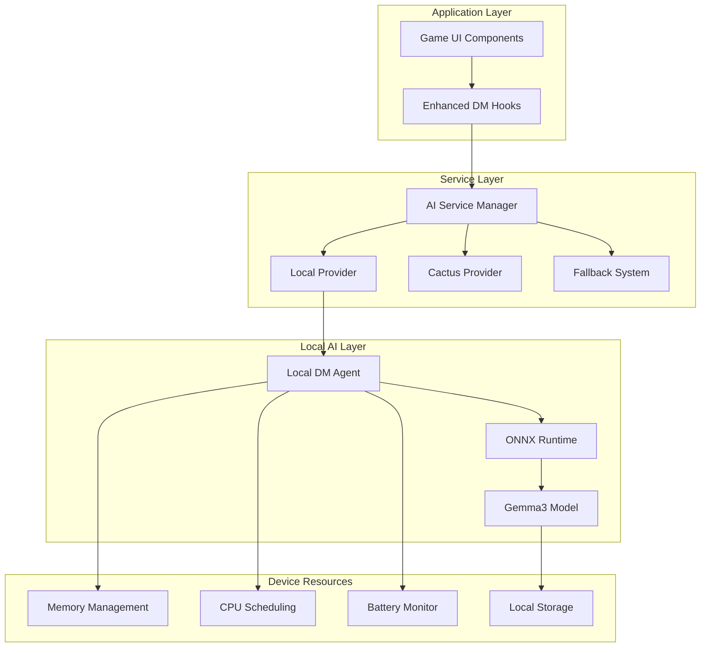

# Design Document

## Overview

The Local DM Agent feature enables on-device AI-powered Dungeon Master functionality using Gemma3 models through ONNX Runtime on iOS and iPadOS devices. This design leverages the existing AI service architecture while adding a new local provider that can run entirely offline, ensuring privacy and reliability for D&D gameplay experiences.

The solution builds upon the current AI service manager pattern, integrating with existing game state management, voice features, and fallback mechanisms. The local DM agent will serve as an alternative to the cloud-based Cactus provider, with seamless switching capabilities based on user preference and connectivity status.

## Architecture

### High-Level Architecture



### Integration with Existing Architecture

The Local DM Agent integrates with the current AI Service Manager as a new provider:

1. **AI Service Manager**: Extended to include LocalDMProvider alongside CactusProvider
2. **Provider Selection**: Intelligent routing based on connectivity, user preference, and device capabilities
3. **Fallback Chain**: Cloud → Local → Rule-based responses
4. **State Management**: Unified game state across all providers

## Components and Interfaces

### Core Components

#### 1. LocalDMProvider

```typescript
export interface LocalDMProvider extends AIProvider {
  // Model management
  initializeModel(): Promise<boolean>;
  isModelReady(): boolean;
  getModelStatus(): ModelStatus;
  
  // Inference
  generateDnDResponse(request: DnDInferenceRequest): Promise<AIResponse>;
  
  // Resource management
  optimizeForDevice(): Promise<void>;
  pauseModel(): void;
  resumeModel(): void;
  
  // Health monitoring
  getResourceUsage(): ResourceUsage;
  healthCheck(): Promise<boolean>;
}
```

#### 2. LocalDMAgent

```typescript
export interface LocalDMAgent {
  // Core functionality
  processPlayerAction(action: string, context: GameContext): Promise<DMResponse>;
  generateNarration(scene: string, context: GameContext): Promise<string>;
  
  // Model lifecycle
  loadModel(config: LocalModelConfig): Promise<boolean>;
  unloadModel(): Promise<void>;
  
  // Performance optimization
  setPerformanceMode(mode: 'performance' | 'balanced' | 'quality'): void;
  enableBatteryOptimization(enabled: boolean): void;
  
  // Privacy and security
  clearModelCache(): Promise<void>;
  exportModelData(): Promise<ModelData>;
}
```

#### 3. ONNXModelManager

```typescript
export interface ONNXModelManager {
  // Model loading
  loadGemma3Model(modelPath: string): Promise<InferenceSession>;
  validateModel(session: InferenceSession): Promise<boolean>;
  
  // Inference execution
  runInference(session: InferenceSession, input: ModelInput): Promise<ModelOutput>;
  
  // Resource management
  optimizeSession(session: InferenceSession, deviceInfo: DeviceInfo): void;
  monitorPerformance(): PerformanceMetrics;
  
  // Memory management
  cleanupSession(session: InferenceSession): Promise<void>;
  getMemoryUsage(): MemoryStats;
}
```

#### 4. DeviceResourceManager

```typescript
export interface DeviceResourceManager {
  // Device monitoring
  getDeviceCapabilities(): DeviceCapabilities;
  monitorBatteryLevel(): BatteryStatus;
  monitorMemoryUsage(): MemoryStatus;
  monitorCPUUsage(): CPUStatus;
  
  // Resource optimization
  requestHighPerformanceMode(): Promise<boolean>;
  enablePowerSavingMode(): void;
  optimizeMemoryUsage(): Promise<void>;
  
  // Thermal management
  monitorThermalState(): ThermalStatus;
  handleThermalThrottling(): void;
}
```

### Data Models

#### LocalModelConfig

```typescript
export interface LocalModelConfig {
  modelName: string;
  modelPath: string;
  quantization: 'int8' | 'int4' | 'fp16' | 'fp32';
  maxTokens: number;
  temperature: number;
  topP: number;
  contextLength: number;
  batchSize: number;
  numThreads: number;
  memoryLimit: number; // in MB
  enableGPU: boolean;
  cacheSize: number;
}
```

#### ModelStatus

```typescript
export interface ModelStatus {
  isLoaded: boolean;
  isReady: boolean;
  loadingProgress: number;
  error: string | null;
  modelInfo: {
    name: string;
    size: number;
    quantization: string;
    memoryUsage: number;
  };
  performance: {
    averageInferenceTime: number;
    tokensPerSecond: number;
    lastInferenceTime: number;
  };
}
```

#### ResourceUsage

```typescript
export interface ResourceUsage {
  memory: {
    used: number;
    available: number;
    percentage: number;
  };
  cpu: {
    usage: number;
    temperature: number;
  };
  battery: {
    level: number;
    isCharging: boolean;
    estimatedTimeRemaining: number;
  };
  thermal: {
    state: 'nominal' | 'fair' | 'serious' | 'critical';
    temperature: number;
  };
}
```

## Data Models

### Model Storage and Management

#### Model Files Structure

```
/Documents/AIModels/
├── gemma-3-2b-int8/
│   ├── model.onnx
│   ├── tokenizer.json
│   ├── config.json
│   └── metadata.json
├── gemma-3-9b-int4/
│   ├── model.onnx
│   ├── tokenizer.json
│   ├── config.json
│   └── metadata.json
└── cache/
    ├── inference_cache.db
    └── embeddings_cache.db
```

#### Model Metadata

```typescript
export interface ModelMetadata {
  name: string;
  version: string;
  size: number;
  quantization: string;
  supportedDevices: string[];
  minMemoryRequirement: number;
  recommendedMemory: number;
  downloadUrl: string;
  checksum: string;
  capabilities: {
    maxContextLength: number;
    supportedLanguages: string[];
    specialTokens: string[];
  };
}
```

### Game Context Integration

#### Enhanced Game Context

```typescript
export interface EnhancedGameContext extends GameContext {
  // Local AI specific context
  localModelPreferences: {
    preferredModel: string;
    performanceMode: 'performance' | 'balanced' | 'quality';
    enableBatteryOptimization: boolean;
  };
  
  // Privacy settings
  privacySettings: {
    keepDataLocal: boolean;
    enableTelemetry: boolean;
    allowModelUpdates: boolean;
  };
  
  // Performance tracking
  performanceMetrics: {
    averageResponseTime: number;
    successRate: number;
    fallbackRate: number;
  };
}
```

## Error Handling

### Error Categories and Responses

#### 1. Model Loading Errors

```typescript
export enum ModelLoadingError {
  INSUFFICIENT_MEMORY = 'insufficient_memory',
  MODEL_NOT_FOUND = 'model_not_found',
  CORRUPTED_MODEL = 'corrupted_model',
  UNSUPPORTED_DEVICE = 'unsupported_device',
  INITIALIZATION_FAILED = 'initialization_failed'
}

export interface ModelErrorHandler {
  handleLoadingError(error: ModelLoadingError): Promise<ErrorResponse>;
  suggestAlternatives(error: ModelLoadingError): ModelAlternative[];
  attemptRecovery(error: ModelLoadingError): Promise<boolean>;
}
```

#### 2. Runtime Errors

```typescript
export enum RuntimeError {
  INFERENCE_TIMEOUT = 'inference_timeout',
  MEMORY_OVERFLOW = 'memory_overflow',
  THERMAL_THROTTLING = 'thermal_throttling',
  BATTERY_CRITICAL = 'battery_critical',
  MODEL_CRASHED = 'model_crashed'
}

export interface RuntimeErrorHandler {
  handleRuntimeError(error: RuntimeError): Promise<void>;
  enableGracefulDegradation(error: RuntimeError): void;
  notifyUser(error: RuntimeError, context: string): void;
}
```

#### 3. Fallback Strategies

```typescript
export interface FallbackStrategy {
  // Fallback chain: Local → Cloud → Rule-based
  executeWithFallback<T>(
    primary: () => Promise<T>,
    secondary: () => Promise<T>,
    tertiary: () => Promise<T>
  ): Promise<T>;
  
  // Intelligent fallback selection
  selectBestFallback(context: GameContext, error: Error): FallbackOption;
  
  // Fallback performance tracking
  trackFallbackUsage(fallback: FallbackOption, success: boolean): void;
}
```

### Error Recovery Mechanisms

#### Automatic Recovery

1. **Model Restart**: Automatic model reloading on crashes
2. **Memory Cleanup**: Aggressive garbage collection on memory errors
3. **Performance Scaling**: Dynamic performance adjustment based on device state
4. **Cache Management**: Intelligent cache clearing to free resources

#### User-Guided Recovery

1. **Model Selection**: Allow users to choose alternative models
2. **Performance Tuning**: User-adjustable performance vs. quality settings
3. **Manual Fallback**: Option to manually switch to cloud or rule-based responses
4. **Diagnostic Tools**: Built-in diagnostics for troubleshooting

## Testing Strategy

### Unit Testing

#### Model Management Tests

```typescript
describe('LocalDMProvider', () => {
  test('should initialize Gemma3 model successfully', async () => {
    const provider = new LocalDMProvider(testConfig);
    const result = await provider.initializeModel();
    expect(result).toBe(true);
    expect(provider.isModelReady()).toBe(true);
  });
  
  test('should handle insufficient memory gracefully', async () => {
    const provider = new LocalDMProvider(lowMemoryConfig);
    const result = await provider.initializeModel();
    expect(result).toBe(false);
    expect(provider.getModelStatus().error).toContain('insufficient_memory');
  });
});
```

#### Inference Tests

```typescript
describe('LocalDMAgent', () => {
  test('should generate contextually appropriate responses', async () => {
    const agent = new LocalDMAgent(testModel);
    const response = await agent.processPlayerAction(
      'I attack the goblin',
      mockGameContext
    );
    
    expect(response.text).toContain('attack');
    expect(response.toolCommands).toContainEqual({
      type: 'roll',
      params: expect.stringMatching(/\d+d\d+/)
    });
  });
  
  test('should respect token limits', async () => {
    const agent = new LocalDMAgent(limitedTokenConfig);
    const response = await agent.generateNarration(longSceneDescription, mockContext);
    
    expect(response.length).toBeLessThanOrEqual(maxTokens * 4); // Rough character estimate
  });
});
```

### Integration Testing

#### AI Service Manager Integration

```typescript
describe('AI Service Manager with Local Provider', () => {
  test('should prefer local provider when available', async () => {
    const manager = new AIServiceManager(configWithLocalProvider);
    const response = await manager.generateDnDResponse(testPrompt, testContext);
    
    expect(response.source).toBe('local');
    expect(response.confidence).toBeGreaterThan(0.8);
  });
  
  test('should fallback to cloud when local fails', async () => {
    const manager = new AIServiceManager(configWithFailingLocal);
    const response = await manager.generateDnDResponse(testPrompt, testContext);
    
    expect(response.source).toBe('cactus');
  });
});
```

### Performance Testing

#### Resource Usage Tests

```typescript
describe('Resource Management', () => {
  test('should not exceed memory limits', async () => {
    const agent = new LocalDMAgent(memoryConstrainedConfig);
    await agent.loadModel(testModelConfig);
    
    const initialMemory = await getMemoryUsage();
    
    // Generate multiple responses
    for (let i = 0; i < 10; i++) {
      await agent.processPlayerAction(`Action ${i}`, mockContext);
    }
    
    const finalMemory = await getMemoryUsage();
    const memoryIncrease = finalMemory - initialMemory;
    
    expect(memoryIncrease).toBeLessThan(memoryConstrainedConfig.memoryLimit);
  });
  
  test('should maintain acceptable response times', async () => {
    const agent = new LocalDMAgent(performanceConfig);
    const startTime = Date.now();
    
    const response = await agent.processPlayerAction(testAction, mockContext);
    const responseTime = Date.now() - startTime;
    
    expect(responseTime).toBeLessThan(10000); // 10 second limit
    expect(response.text).toBeTruthy();
  });
});
```

### Device Testing

#### iOS Device Testing Matrix

| Device | iOS Version | Memory | Expected Performance |
|--------|-------------|---------|---------------------|
| iPhone 15 Pro | 17.0+ | 8GB | Gemma-3-9B (int4) |
| iPhone 14 | 16.0+ | 6GB | Gemma-3-2B (int8) |
| iPhone 13 | 15.0+ | 4GB | Gemma-3-2B (int8) |
| iPad Pro M2 | 16.0+ | 16GB | Gemma-3-9B (fp16) |
| iPad Air | 15.0+ | 8GB | Gemma-3-2B (int8) |

#### Performance Benchmarks

```typescript
interface PerformanceBenchmark {
  device: string;
  model: string;
  averageInferenceTime: number;
  tokensPerSecond: number;
  memoryUsage: number;
  batteryImpact: number; // mAh per hour
  thermalImpact: 'low' | 'medium' | 'high';
}
```

### User Acceptance Testing

#### Gameplay Experience Tests

1. **Response Quality**: Compare local vs. cloud response quality
2. **Response Time**: Measure user satisfaction with response times
3. **Battery Impact**: Monitor battery drain during extended gameplay
4. **Thermal Comfort**: Ensure device doesn't become uncomfortably warm
5. **Privacy Satisfaction**: Validate user comfort with local processing

#### Accessibility Testing

1. **Voice Integration**: Test with text-to-speech and speech recognition
2. **Low Vision**: Ensure error messages are screen reader friendly
3. **Motor Impairments**: Test with voice-only input modes
4. **Cognitive Load**: Ensure error recovery doesn't overwhelm users
