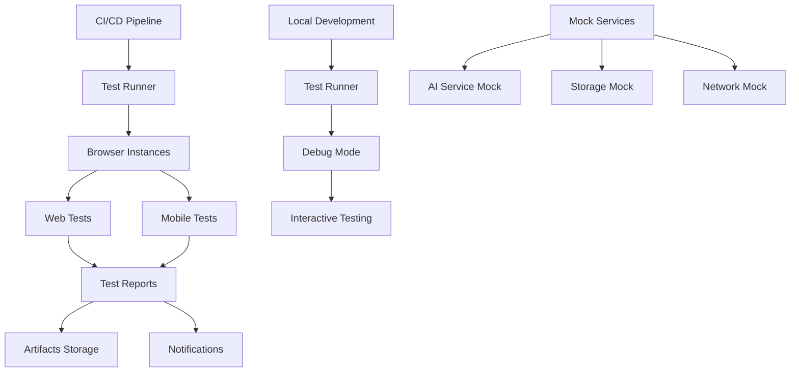

# Design Document

## Overview

This design outlines a comprehensive Playwright end-to-end testing framework for the AI D&D platform. The testing suite will provide automated verification of core functionality, regression prevention, and continuous integration support across web, iOS, and Android platforms.

The testing framework will be built using Playwright with TypeScript, leveraging the existing project structure and integrating with the current development workflow. Tests will cover critical user journeys, error scenarios, and cross-platform compatibility while providing detailed reporting and debugging capabilities.

## Architecture

### Test Framework Structure

```
tests/
├── e2e/                          # End-to-end test files
│   ├── character-creation.spec.ts
│   ├── game-continuation.spec.ts
│   ├── dm-interaction.spec.ts
│   ├── character-sheet.spec.ts
│   ├── dice-rolling.spec.ts
│   ├── voice-features.spec.ts
│   ├── error-handling.spec.ts
│   └── performance.spec.ts
├── fixtures/                     # Test data and fixtures
│   ├── characters.json
│   ├── game-states.json
│   └── mock-responses.json
├── page-objects/                 # Page Object Model classes
│   ├── HomePage.ts
│   ├── NewGamePage.ts
│   ├── GamePage.ts
│   └── CharacterSheetModal.ts
├── utils/                        # Test utilities and helpers
│   ├── test-helpers.ts
│   ├── mock-services.ts
│   ├── data-generators.ts
│   └── assertions.ts
└── config/                       # Test configuration
    ├── playwright.config.ts
    ├── test-environments.ts
    └── ci-config.ts
```

### Test Execution Architecture



## Components and Interfaces

### Core Test Components

#### 1. Test Configuration Manager
```typescript
interface TestConfig {
  baseURL: string;
  timeout: number;
  retries: number;
  browsers: BrowserType[];
  devices: DeviceDescriptor[];
  environments: TestEnvironment[];
}

class TestConfigManager {
  static getConfig(environment: string): TestConfig;
  static setupBrowser(browserName: string): Browser;
  static setupMobileDevice(device: string): BrowserContext;
}
```

#### 2. Page Object Model Classes
```typescript
abstract class BasePage {
  protected page: Page;
  protected baseURL: string;
  
  constructor(page: Page);
  abstract navigate(): Promise<void>;
  abstract waitForLoad(): Promise<void>;
  protected waitForElement(selector: string): Promise<ElementHandle>;
}

class HomePage extends BasePage {
  async clickNewGame(): Promise<void>;
  async clickContinueGame(): Promise<void>;
  async hasSavedGame(): Promise<boolean>;
}

class NewGamePage extends BasePage {
  async selectWorld(worldName: string): Promise<void>;
  async selectLocation(locationName: string): Promise<void>;
  async selectRace(raceName: string): Promise<void>;
  async selectClass(className: string): Promise<void>;
  async setAttributes(attributes: StatBlock): Promise<void>;
  async selectSkills(skills: string[]): Promise<void>;
  async enterCharacterDetails(name: string, background: string): Promise<void>;
  async startGame(): Promise<void>;
}

class GamePage extends BasePage {
  async sendMessageToDM(message: string): Promise<void>;
  async waitForDMResponse(): Promise<string>;
  async openCharacterSheet(): Promise<void>;
  async performDiceRoll(skill: string): Promise<number>;
  async moveCharacter(direction: string): Promise<void>;
}
```

#### 3. Mock Service Layer
```typescript
interface MockServiceConfig {
  aiResponses: Record<string, string>;
  networkDelay: number;
  errorRate: number;
  fallbackEnabled: boolean;
}

class MockAIService {
  static setup(config: MockServiceConfig): void;
  static mockDMResponse(input: string, response: string): void;
  static simulateFailure(errorType: string): void;
  static enableFallback(): void;
}

class MockStorageService {
  static mockSavedGame(gameState: any): void;
  static simulateStorageError(): void;
  static clearMockData(): void;
}
```

#### 4. Test Data Generators
```typescript
class TestDataGenerator {
  static generateCharacter(options?: Partial<Character>): Character;
  static generateGameState(options?: Partial<GameState>): GameState;
  static generateRandomInput(): string;
  static generateInvalidInput(): string;
}
```

### Test Utilities

#### 1. Custom Assertions
```typescript
class GameAssertions {
  static async expectCharacterCreated(page: Page, character: Character): Promise<void>;
  static async expectGameStateLoaded(page: Page, gameState: GameState): Promise<void>;
  static async expectDMResponse(page: Page, expectedPattern: RegExp): Promise<void>;
  static async expectErrorHandled(page: Page, errorType: string): Promise<void>;
}
```

#### 2. Performance Monitoring
```typescript
class PerformanceMonitor {
  static async measurePageLoad(page: Page): Promise<number>;
  static async measureAIResponseTime(page: Page): Promise<number>;
  static async measureMemoryUsage(page: Page): Promise<number>;
  static generatePerformanceReport(): PerformanceReport;
}
```

## Data Models

### Test Data Structures

```typescript
interface TestCharacter {
  id: string;
  name: string;
  race: string;
  class: string;
  level: number;
  stats: StatBlock;
  skills: string[];
  background: string;
}

interface TestGameState {
  characters: TestCharacter[];
  playerCharacterId: string;
  gameWorld: string;
  startingArea: string;
  worldState?: GameWorldState;
  sessionId: string;
}

interface TestScenario {
  name: string;
  description: string;
  setup: () => Promise<void>;
  teardown: () => Promise<void>;
  expectedOutcome: any;
}

interface TestReport {
  testSuite: string;
  totalTests: number;
  passed: number;
  failed: number;
  skipped: number;
  duration: number;
  coverage: number;
  screenshots: string[];
  videos: string[];
  errors: TestError[];
}
```

### Mock Data Models

```typescript
interface MockAIResponse {
  input: string;
  output: string;
  delay: number;
  shouldFail: boolean;
}

interface MockGameData {
  characters: TestCharacter[];
  gameStates: TestGameState[];
  aiResponses: MockAIResponse[];
  errorScenarios: ErrorScenario[];
}
```

## Error Handling

### Test Error Management

```typescript
class TestErrorHandler {
  static async handleTestFailure(test: Test, error: Error): Promise<void>;
  static async captureScreenshot(page: Page, testName: string): Promise<string>;
  static async captureVideo(page: Page, testName: string): Promise<string>;
  static async generateErrorReport(error: TestError): Promise<ErrorReport>;
}

interface TestError {
  testName: string;
  errorType: string;
  message: string;
  stack: string;
  screenshot?: string;
  video?: string;
  timestamp: number;
}
```

### Application Error Testing

```typescript
class ErrorScenarioTester {
  static async testAIServiceFailure(page: Page): Promise<void>;
  static async testNetworkFailure(page: Page): Promise<void>;
  static async testStorageFailure(page: Page): Promise<void>;
  static async testInvalidInput(page: Page): Promise<void>;
  static async testConcurrentUsers(pages: Page[]): Promise<void>;
}
```

## Testing Strategy

### Test Categories

#### 1. Smoke Tests
- Basic application loading
- Core navigation functionality
- Essential user flows
- Critical error scenarios

#### 2. Functional Tests
- Complete character creation flow
- Game state persistence and loading
- DM interaction and AI responses
- Character sheet functionality
- Dice rolling mechanics
- Voice feature integration

#### 3. Integration Tests
- AI service integration
- Storage system integration
- Cross-component communication
- Data flow validation

#### 4. Cross-Platform Tests
- Web browser compatibility (Chrome, Firefox, Safari)
- Mobile device testing (iOS, Android)
- Responsive design validation
- Touch interaction testing

#### 5. Performance Tests
- Page load time measurement
- AI response time monitoring
- Memory usage tracking
- Concurrent user simulation

#### 6. Regression Tests
- Bug fix verification
- Feature stability testing
- Backward compatibility
- Data migration testing

### Test Execution Strategy

#### 1. Parallel Execution
```typescript
// playwright.config.ts
export default defineConfig({
  workers: process.env.CI ? 2 : 4,
  fullyParallel: true,
  projects: [
    {
      name: 'chromium',
      use: { ...devices['Desktop Chrome'] },
    },
    {
      name: 'firefox',
      use: { ...devices['Desktop Firefox'] },
    },
    {
      name: 'webkit',
      use: { ...devices['Desktop Safari'] },
    },
    {
      name: 'mobile-chrome',
      use: { ...devices['Pixel 5'] },
    },
    {
      name: 'mobile-safari',
      use: { ...devices['iPhone 12'] },
    },
  ],
});
```

#### 2. Test Environment Management
```typescript
class TestEnvironmentManager {
  static async setupTestEnvironment(env: string): Promise<void>;
  static async seedTestData(): Promise<void>;
  static async cleanupTestData(): Promise<void>;
  static async resetApplication(): Promise<void>;
}
```

#### 3. CI/CD Integration
```yaml
# .github/workflows/e2e-tests.yml
name: E2E Tests
on: [push, pull_request]
jobs:
  test:
    runs-on: ubuntu-latest
    steps:
      - uses: actions/checkout@v3
      - uses: actions/setup-node@v3
      - name: Install dependencies
        run: npm ci
      - name: Install Playwright
        run: npx playwright install
      - name: Run E2E tests
        run: npm run test:e2e
      - name: Upload test results
        uses: actions/upload-artifact@v3
        if: always()
        with:
          name: playwright-report
          path: playwright-report/
```

### Test Data Management

#### 1. Test Fixtures
```typescript
// fixtures/characters.json
{
  "testCharacters": [
    {
      "id": "test-fighter-001",
      "name": "Test Fighter",
      "race": "Human",
      "class": "Fighter",
      "level": 1,
      "stats": { "strength": 16, "dexterity": 14, "constitution": 15, "intelligence": 10, "wisdom": 12, "charisma": 8 },
      "skills": ["athletics", "intimidation"],
      "background": "A test character for automated testing"
    }
  ]
}
```

#### 2. Dynamic Test Data
```typescript
class TestDataFactory {
  static createRandomCharacter(): TestCharacter;
  static createGameStateWithCharacter(character: TestCharacter): TestGameState;
  static createAIResponseSet(scenario: string): MockAIResponse[];
}
```

### Reporting and Analytics

#### 1. Test Reports
```typescript
class TestReporter {
  static generateHTMLReport(results: TestResult[]): string;
  static generateJUnitReport(results: TestResult[]): string;
  static generateCoverageReport(): CoverageReport;
  static uploadReports(destination: string): Promise<void>;
}
```

#### 2. Metrics Collection
```typescript
class TestMetrics {
  static trackTestExecution(test: Test, duration: number): void;
  static trackFailureRate(suite: string, rate: number): void;
  static trackPerformanceMetrics(metrics: PerformanceMetrics): void;
  static generateTrendAnalysis(): TrendReport;
}
```

## Implementation Phases

### Phase 1: Foundation Setup
1. Install and configure Playwright
2. Set up basic test structure and configuration
3. Create core page object models
4. Implement basic smoke tests
5. Set up CI/CD integration

### Phase 2: Core Functionality Testing
1. Implement character creation tests
2. Add game continuation tests
3. Create DM interaction tests
4. Build character sheet tests
5. Add dice rolling tests

### Phase 3: Advanced Features
1. Implement voice feature tests
2. Add cross-platform compatibility tests
3. Create performance monitoring tests
4. Build error handling tests
5. Add regression test suite

### Phase 4: Optimization and Maintenance
1. Optimize test execution speed
2. Enhance reporting and analytics
3. Add advanced debugging tools
4. Implement test maintenance automation
5. Create comprehensive documentation

## Security Considerations

### Test Data Security
- Use synthetic test data only
- Avoid real user credentials or personal information
- Implement secure test data cleanup
- Encrypt sensitive test configurations

### Test Environment Security
- Isolate test environments from production
- Use secure communication channels
- Implement proper access controls
- Monitor test environment security

### CI/CD Security
- Secure test artifacts and reports
- Use encrypted environment variables
- Implement proper secret management
- Monitor CI/CD pipeline security

## Monitoring and Maintenance

### Test Health Monitoring
```typescript
class TestHealthMonitor {
  static monitorTestStability(): Promise<StabilityReport>;
  static detectFlakyTests(): Promise<FlakyTest[]>;
  static analyzeFailurePatterns(): Promise<FailureAnalysis>;
  static generateMaintenanceRecommendations(): Promise<MaintenanceReport>;
}
```

### Automated Maintenance
```typescript
class TestMaintenance {
  static updateTestData(): Promise<void>;
  static cleanupOldArtifacts(): Promise<void>;
  static updateSelectors(): Promise<void>;
  static optimizeTestSuite(): Promise<void>;
}
```
